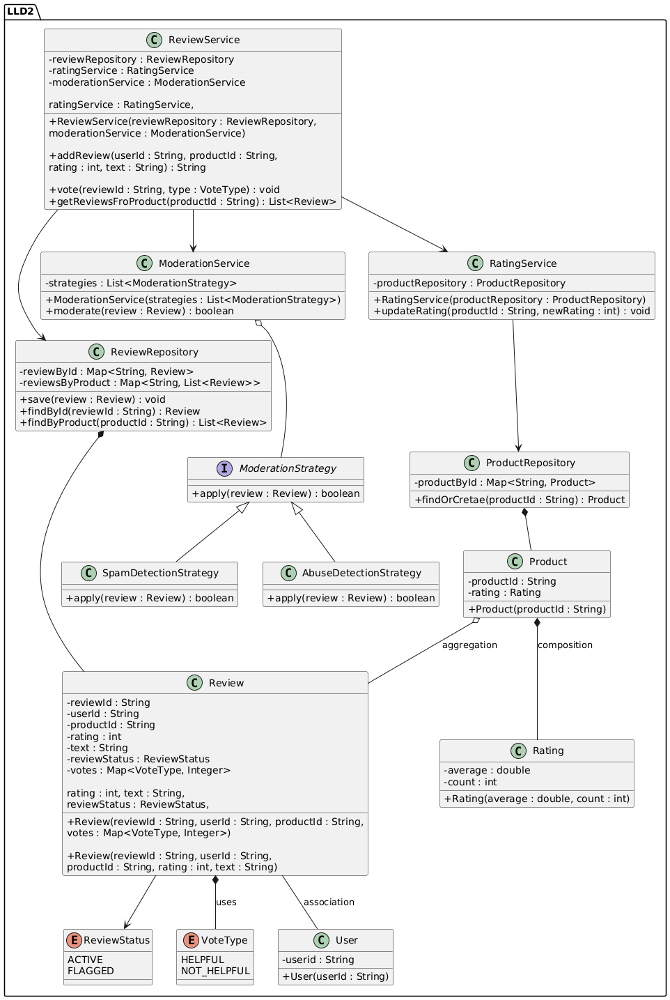

## Problem Statement
## Design a Review and Rating System similar to Amazon that allows verified buyers to submit reviews, rate products, mark reviews helpful, and compute aggregate ratings.
### Functional Requirements
- Submit product review
- Submit product rating (1–5)
- Only verified buyers can review
- Edit / delete own review
- Mark review as helpful
- Fetch reviews for a product
- Compute average rating

### Non-Functional Requirements
- High read throughput (review-heavy)
- Eventual consistency for aggregates
- Abuse & spam prevention
- Idempotent review submission
- Scalable for millions of reviews

